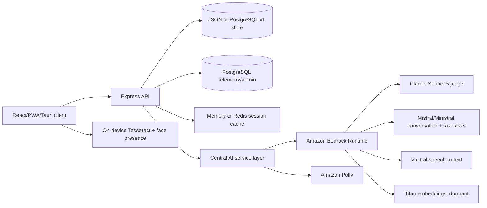
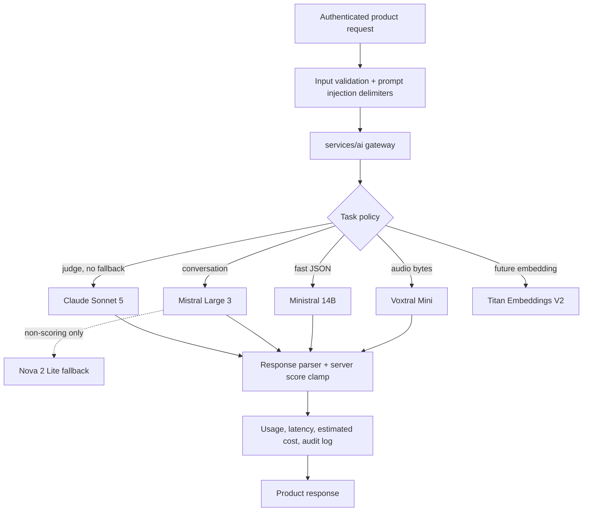

# Prism AI Architecture

**Assessment date:** 2026-07-16  
**Canonical source:** `studai-prism/main`  
**Historical worktrees:** `wt-phase1`, `wt-phase2`, and `wt-phase3` are detached
snapshots; their phase implementations are already present on `main`.

## Product AI Architecture Overview

Prism measures evidence of decision-making, communication, collaboration,
problem solving, and AI/digital fluency in a scenario conversation. Its users
are candidates, employers/institutions, human raters, psychometricians, and
administrators. The critical journey is payment/entitlement, consent,
calibration, live assessment, server-side panel scoring, report issuance, and
optional cryptographically verifiable evidence.

The most important design fact is that the judge is a measuring instrument, not
an interchangeable chatbot. A model-family change can move scores even when API
behavior appears correct. Judge routing is therefore pinned, audited, and never
automatically falls back to a different model.

### Current Product Architecture

The web/API host remains Azure App Service today. PostgreSQL, Razorpay, SMTP,
Redis, Sentry, Tauri, and calibration jobs are provider-neutral. A later ECS
Fargate move is recommended but is not required for the Bedrock AI migration.

## AI Dependency Map

| Feature | Previous provider/model | Purpose | Input | Output | Latency requirement | Cost impact | Business importance | Migration complexity |
| --- | --- | --- | --- | --- | --- | --- | --- | --- |
| Calibration tier | Azure OpenAI GPT-5.4 | Select initial scenario tier | Short writing sample | foundational/intermediate/advanced | Low, blocking | Low | High | Low |
| Entry estimator | Azure OpenAI GPT-5.4 | Seed Bayesian ability prior | Writing sample | four anchors and $\theta_0$ | Low, blocking with heuristic fallback | Low | High | Low |
| Opening turn | Azure OpenAI GPT-5.4 | Start roleplay | Scenario/cast/style | Persona-message JSON | Interactive, target <5 s | Medium | Critical | Medium |
| Conversation director/avatar | Azure OpenAI GPT-5.4 | Continue adaptive roleplay | Full history + director instruction | Persona-message JSON | Interactive, target <8 s | Medium | Critical | Medium |
| Micro-rater | Azure OpenAI GPT-5.4 | Non-blocking evidence-ledger update | One candidate turn | five levels 0-4/NA | Fast, target <3 s | Medium when enabled | High | Low |
| Full-transcript judge panel | Azure OpenAI GPT-5.4, five samples | Authoritative report evidence and scores | Scenario + transcript + rubric | Scores, evidence, feedback JSON | Submit-time, target p95 <60 s | Very high | Critical | Very high |
| Dual-scorer Channel A | Azure OpenAI GPT-5.4 / optional second deployment | Turn-level $k$-vote scoring | Candidate turns | modal levels + stability | Submit-time | Very high when enabled | Critical | High |
| Counterfactual replay | Azure OpenAI GPT-5.4 | Formative practice only | Prior moment + retry answer | Persona turn + practice levels | Interactive | Low | Medium | Low |
| Team simulation | Azure OpenAI GPT-5.4 | Qualitative team observations | Consented profiles + transcript | Non-numeric observations | Interactive/submit-time | Low | Medium | Medium |
| Speech-to-text | OpenAI/Azure Whisper | Voice input as text only | In-memory audio | Transcript | Interactive, previous 5-15 s | Medium | High | Medium |
| Persona TTS | Azure Speech neural voices | Output-only accessibility | Authorized avatar line | MP3 | Interactive, previous 2-5 s | Dark by default | Medium | Medium |
| Identity OCR | Browser Tesseract.js | Extract document text locally | User-selected image | Text/name-match signal | Interactive | Zero cloud cost | High | Intentionally retained |
| Face presence | Browser face-api.js | Integrity presence checks only | Camera frame | Presence/landmark events | Real time | Zero cloud cost | High | Intentionally retained |
| Behavioral/calibration models | Local rules + Python LightGBM/statistics | Shadow features, IRT, DIF, CI, reliability | Logged responses/human ratings | Features and frozen run artifacts | Offline/non-blocking | Zero model API cost | Critical | No provider migration |

There was no runtime embedding call, vector database, RAG pipeline, image
generation, agent framework, or fine-tuning API. The embedding adapter is future
capacity only and does not create a knowledge base or vector store.

## Product Requirements

- **Scale:** near-zero current traffic, designed to grow to institution cohorts;
  the main burst is five parallel full-transcript judges per submission.
- **Performance:** conversation calls are blocking; scoring can tolerate tens of
  seconds but must not strand the candidate.
- **Security:** candidate transcripts and identity data are sensitive; no browser
  cloud-AI calls, no secrets in code, temporary IAM credentials, pseudonymous
  telemetry, immutable admin audit, and erasure support are required.
- **Measurement:** scores remain server-side, 0-100 clamped/recomputed, audited,
  and idempotent per completed session. Facial expression, voice prosody, tone,
  and emotion never contribute to a score.
- **Cost:** previous typical AI COGS was about $0.34/session, with the judge panel
  responsible for roughly 65% of LLM spend.

## Bedrock Model Comparison

Availability and model details were checked against AWS model cards on
2026-07-16. Cost is on-demand USD per million input/output tokens where the
official price was available.

| Model | Best for | Context / max output | Latency | Cost | Reason to choose | Reason not to choose |
| --- | --- | --- | --- | --- | --- | --- |
| Claude Sonnet 5 | High-integrity reasoning and rubric evaluation | 1M / 128K | Medium-high | $2/$10 launch through 2026-08-31; then $3/$15 | Strongest fit for nuanced evidence judging; Converse, caching, structured output | Global-only from India; adaptive reasoning adds latency; requires full re-anchoring |
| Claude Fable 5 | Long autonomous knowledge work | 1M / 128K | High | High | Deep multi-stage work | Temperature constraints, higher refusal rate, provider data-sharing opt-in; wrong fit for short judges |
| Claude Haiku 4.5 | Fast capable assistant work | 200K / 64K | Low | Low-medium | Good fast Anthropic option | Global-only from India and less appropriate as the authoritative instrument |
| Amazon Nova 2 Lite | Low-cost multimodal automation | 1M / 64K | Low | $0.35/$2.95 from Mumbai global inference | Excellent non-scoring fallback and high throughput | Global routing; must not silently replace a pinned judge |
| Mistral Large 3 | India-local multilingual conversation and multimodal analysis | 256K / 32K | Medium | $0.59/$1.76 in Mumbai | Strong value, Converse, prompt caching, in-Region data processing | Must be human-evaluated for persona quality and separately anchored for judging |
| Ministral 14B 3.0 | Classification, micro-rating, short JSON | 128K / 8K | Low | $0.24/$0.24 in Mumbai | Very low cost and India-local | Not suitable as the primary full-transcript judge |
| Meta Llama 3.3 70B Instruct | Open-model reasoning/coding | 128K / 4K | Medium | Medium | Portability and strong general capability | Older cutoff, short output, no India-local availability in the checked card |
| Cohere Command R+ | RAG and tool workflows | 128K / 4K | Medium | Medium-high | Strong retrieval orchestration | Legacy, EOL 2026-08-19, and Prism has no RAG workload |
| Mistral Large (2402) | General multilingual enterprise work | 32K / 4K | Medium | Medium | Mumbai availability | Superseded by Mistral Large 3; context is tight for growing transcripts |
| GPT-5.4 on Bedrock | Lowest model-family migration risk | 272K | High | High | Same named family as previous judge | Bedrock Mantle Responses only: no Converse portability or Runtime invocation logs; retains provider-specific SDK surface |
| Titan Text Embeddings V2 | Future text retrieval | 8K / 256, 512, or 1024 dimensions | Low | Low | India-local, configurable dimensions, native Bedrock | No current product use; adding RAG now would be scope and cost without evidence |
| Voxtral Mini 3B 2507 | In-memory speech-to-text | 32K | Low | $0.05/$0.05 token pricing in Mumbai | Accepts raw `webm` AudioBlock; no S3; India-local | Tamil quality must be validated before multilingual flag enablement |

## Final Model Decision

- **Primary model:** `global.anthropic.claude-sonnet-5` for full and turn-level
  judging. It is never an automatic fallback target or source.
- **Secondary model:** `mistral.mistral-large-3-675b-instruct` for India-local
  conversation and an explicit shadow judge candidate.
- **Operational fallback:** `global.amazon.nova-2-lite-v1:0`, permitted only for
  non-scoring workloads and only after explicit global-routing approval.
- **Embedding model:** `amazon.titan-embed-text-v2:0`; adapter present, feature
  dormant until a real retrieval use case is approved.
- **Image/multimodal model:** Mistral Large 3 for future India-local analysis.
  No image feature is enabled by this migration.
- **Small/fast model:** `mistral.ministral-3-14b-instruct` for calibration,
  entry estimation, and micro-rating.
- **Speech-to-text:** `mistral.voxtral-mini-3b-2507` through Bedrock Runtime.
- **Text-to-speech:** Amazon Polly, output only, flag off by default.

## Target Request Flow

## Reliability and Security

- AWS SDK default credentials only; production rejects long-lived Bedrock API
  keys and static access keys without an STS session token.
- Model IDs are allowlisted from environment configuration; request-supplied
  arbitrary models are rejected.
- Transient 429/5xx/model-not-ready failures use bounded exponential backoff.
- Every call has an abort timeout; judge and interactive tasks have separate
  budgets.
- Optional Bedrock Guardrails can filter prompt attacks and sensitive content.
  Existing candidate delimiters and injection instructions remain in force.
- Logs contain task, model, request ID, token counts, latency, fallback state,
  and estimated cost; they do not contain prompts, transcripts, audio, or PII.
- Bedrock invocation body logging should remain disabled for production
  assessment data unless a separately approved encrypted retention policy exists.

## Measurement Cutover Gate

API correctness is not score equivalence. Before paid or externally verified
scoring uses the new judge:

1. Freeze a fixed set of golden transcripts and human references.
2. Shadow-score with the previous GPT-5.4 outputs and Claude Sonnet 5.
3. Compare per-dimension shift, rank order, panel disagreement, evidence-quote
   precision, malformed-output rate, and human-panel agreement.
4. Require panel-vs-human agreement to meet the existing human-vs-human gate.
5. Refresh conformal intervals and update `anchorRunId` only after review.
6. Set `PRISM_DRIFT_HARD=true` once the first calibration anchor freezes.

Until that gate passes, tests prove software behavior, not psychometric
equivalence.

## Expected Improvements

- **Cost:** projected text-model COGS falls from about $0.295/session to roughly
  $0.15 during Sonnet launch pricing and $0.22 afterward under the existing
  token assumptions. Speech cost requires live audio-token measurement.
- **Performance:** India-local Mistral/Voxtral removes cross-region latency from
  interactive conversation and STT; exact p95 remains a staging measurement.
- **Scalability:** Bedrock Runtime normalizes model access; retries, timeouts,
  prompt caching, and request metadata are centralized.
- **Security:** API keys are removed, model IDs are allowlisted, global routing
  is opt-in, and raw audio stays in memory.
- **Maintainability:** all cloud AI calls pass through one service layer; routes
  no longer know provider SDK formats.

## Future Scaling

1. Move the Node service to ECS Fargate with an ALB and task role.
2. Enable the PostgreSQL operational store before scaling above one instance.
3. Add application inference profiles for cost allocation when traffic warrants.
4. Request quotas from measured concurrency, not forecasts.
5. Consider provisioned/priority capacity only after p95 and throttle data show
   on-demand capacity is insufficient.
6. Introduce RAG only for a concrete, consented product workflow; use Titan
   embeddings and a separately governed vector store at that point.

## AWS Sources

- [Models at a glance](https://docs.aws.amazon.com/bedrock/latest/userguide/model-cards.html)
- [Converse API](https://docs.aws.amazon.com/bedrock/latest/userguide/conversation-inference.html)
- [Regional availability](https://docs.aws.amazon.com/bedrock/latest/userguide/models-region-compatibility.html)
- [Guardrails](https://docs.aws.amazon.com/bedrock/latest/userguide/guardrails.html)
- [Prompt caching](https://docs.aws.amazon.com/bedrock/latest/userguide/prompt-caching.html)
- [Structured outputs](https://docs.aws.amazon.com/bedrock/latest/userguide/structured-output.html)
