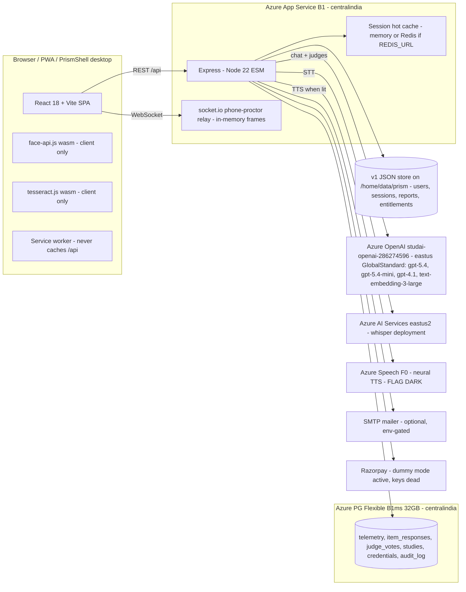

# StudAI Prism — System Architecture (as built)

Every claim below is anchored to the codebase at commit `8f91e45` or to a live Azure query on 2026-07-08.

## 1. Topology

## 2. Runtime components

| Component | Implementation | Cost class |
| --- | --- | --- |
| Web/API server | Express, single B1 instance (1 core / 1.75 GB), `server/app.js` (helmet CSP, rate limiters), `server/index.js` boot | Fixed |
| Frontend | Vite build served statically from the same App Service (`dist/`), design-token system, framer-motion story homepage | Fixed (bundled) |
| Session hot cache | `sessionCache` — in-memory by default, Redis when `REDIS_URL` set (`session_cache_backend` boot log). Prod today: memory | $0 today |
| v1 store | JSON files under `DATA_DIR=/home/data/prism` (users, sessions, reports, entitlements); PG mirror behind `PRISM_PG_STORE` (off) | $0 marginal |
| Telemetry DB | PG Flexible Server B1ms, migrations 0001–0010, append-only guards on study tables | Fixed |
| Phone proctor | socket.io relay, frames in memory only, `maxHttpBufferSize 5MB` | Bandwidth only |
| Desktop shell | Tauri v2 (`desktop/`), loads the site; no server cost | $0 |
| PWA | manifest + conservative service worker | $0 |
| Background jobs / queues / cron | **None** — all work is request-scoped; calibration jobs are operator-run Python (local), reading PG | $0 |
| CDN | **None** — assets served by App Service | $0 (upgrade path documented) |
| Email | nodemailer over env SMTP (dark unless SMTP_* set); 5/10min/IP limiter | Provider-dependent |
| Payments | Razorpay order+HMAC verify; `PRISM_DUMMY_PAYMENTS=true` live (keys rejected 401 as of 2026-07-05) | 2–3% when live |

## 3. The AI request flows (what actually spends money)

1. **/start** — 1 chat call (opening turn, 350 max output) + 1 tiny calibration call (8-token tier on the v1 path; 60-token entry estimator when `PRISM_V2_EXECUTIVE` is lit).
2. **/message** (per exchange) — 1 chat call with **full history resent** (system ~800 tok + growing history), 350 max output. Executive path adds 1 micro-rater call (150 max) per candidate turn — **flag dark in prod**.
3. **/transcribe** (per spoken answer) — 1 Whisper call, billed per audio minute; 15 MB upload cap, 20/min/IP limiter.
4. **/speech** (TTS, **flag dark**) — per avatar line, ≤600 chars, ≤150 calls/session.
5. **/evaluate** (submit) — the big one: **judge panel = `PRISM_JUDGE_SAMPLES` (default 5) parallel gpt-5.4 calls**, each with the full transcript + ~1,000-token judge prompt + 700-token rubric, `max_completion_tokens 2000`; plus fire-and-forget vote persistence. Dual-scorer (K_A=20/K_B=5 per-turn votes ×150 tok) exists behind `PRISM_V2_DUAL_SCORER` — **dark**.
6. **Replay / Teamfit** — flagged dark; ≤3 and ≤6 turns respectively when lit.

## 4. Security & cost guards (verified in `server/lib/security.js` + routes)

- Session wall-clock: 35 min hard (410 after).
- Rate limiters: auth 5/min, transcribe 20/min, events 60/min, send-report 5/10min, global API 300/min per IP.
- TTS budget 150 calls & 600 chars; text must match an avatar line verbatim (no free TTS proxy).
- Reassessment gap 90 days (`PRISM_REASSESSMENT_GAP_DAYS`) — caps per-user annual volume by design.
- Judge concurrency mapLimit 6; retries ≤2 with backoff.

## 5. Environment variable inventory (cost-relevant)

`AZURE_OPENAI_ENDPOINT/DEPLOYMENT/API_KEY/API_VERSION`, `PRISM_JUDGE_SAMPLES` (1–25), `PRISM_JUDGE_MODEL_B`, `PRISM_JUDGE_MODELS`, `PRISM_JUDGE_K_A/K_B` (dual), `AZURE_WHISPER_*`, `AZURE_SPEECH_KEY/REGION` + `PRISM_TTS_NEURAL`, `SMTP_*`, `RAZORPAY_*`, `PRISM_DUMMY_PAYMENTS`, `PRISM_SKIP_VERIFICATION`, `REDIS_URL`, `DATA_DIR`, `DATABASE_URL`, feature flags `PRISM_V2_*`, `PRISM_VELOCITY/PRESSURE/LANG/REPLAY/TEAMFIT` (all dark).

## 6. What does not exist (searched, absent)

Embeddings API usage, vector database, RAG, image/video generation, fine-tuning jobs, realtime/WebRTC AI, Twilio/SMS, WhatsApp/Telegram/Instagram, server-side OCR (tesseract runs in the browser), server-side face analysis (face-api runs in the browser). The `text-embedding-3-large` deployment exists on the shared OpenAI account but **no Prism code calls it**.
